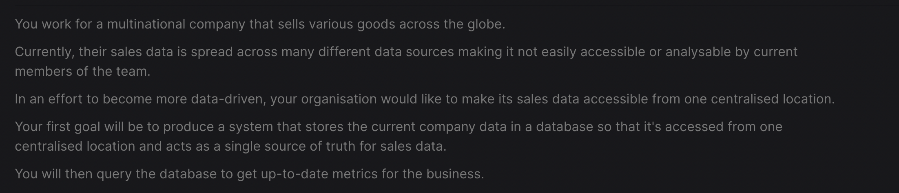

#  ETL Centralisation AIcore 

### 📌 Table of Contents
- [Introduction](#introduction)
- [Data Sources Overview](#data-sources-overview)
- [Technologies](#technologies)
- [Setup](#setup)
- [Usage](#usage)
- [Screenshots](#screenshots)
- [License](#license)

### 🎯 Introduction


> ℹ️ **Task:** The core objective is to manage extensive data derived from six unique sources, each marked with distinct characteristics, necessary cleaning/extraction steps, and specific key fields. Below is an inclusive overview:

Each source necessitates tailored strategies for extraction, cleaning, and utilization due to their unique challenges.

> 🤔 **Approach:** I initiated with writing and testing functions in Notebooks for each data source. After meticulous verification, the code was systematically organized into scripts, with strict adherence to OOP principles ensuring modularity and readability.

### 📊 Data Sources Overview <a name="data-sources-overview"></a>
#### 1.RDS Database in AWS (Order Table)

- **Table**: `order_table`
- **Relevance**: High; contains crucial sales information.
- **Fields to Use**: `date_uuid`, `user_uuid`, `card_number`, `store_code`, `product_code`, `product_quantity`.
- **Cleaning**: 
#### 2. RDS Database in AWS (User Data)

- **Table**: `dim_users`
- **Primary Key**: `user_uuid`
- **Cleaning**: 

#### 3. AWS S3 Public Link (Card Details)

- **Source**: PDF available through an S3 public link.
- **Table**: `dim_card_details`
- **Reading Method**: Utilizing the `tabula` package for PDF extraction.
- **Primary Key**: `card_number`
- **Cleaning**: 

#### 4. AWS S3 Bucket (Product Data)

- **Table**: `dim_product`
- **Reading Method**: Using `boto3` for data retrieval.
- **Primary Key**: `product_code`
- **Cleaning**: 
#### 5. Restful API (Store Details)

- **Table**: `dim_store_details`
- **Reading Method**: GET method from the API.
- **Data Format**: JSON; convert to a Pandas DataFrame.
- **Primary Key**: `store_code`
- **Cleaning**: 
#### 6. Public Link (Date Times)

- **Table**: `dim_date_times`
- **Reading Method**: JSON available through a public link; convert to a Pandas DataFrame.
- **Primary Key**: `date_uuid`
- **Cleaning**: 

### 💻 Technologies <a name="technologies"></a>
- **Language:** `Python`
- **Packages:** `Tabula`, `Boto3`, `Pandas`, `Tree`, `SQLAlchemy`, `Argparse`, `Pyyaml`, `Json`, `Requests`, `OS`
- **Cloud Services:** `AWS RDS, S3`
- **Database Management System:** `PostgreSQL (PGAdmin)`

### 🛠 Setup <a name="setup"></a>
To run this project, you need to create a `.env` file in your root directory and add your API key:
```shell
API_KEY=your_api_key
```
You need to create a `db_creds.yaml` file in your root directory and add your postgres and RDS details:
```shell

RDS:
  HOST: 
  PASSWORD: 
  USER: 
  DATABASE: 
  PORT: 

LOCAL:
  HOST: 
  PASSWORD: 
  USER: 
  DATABASE: 
  PORT:
```
These are required for the final centralisation of tables into Postgres and the extraction from RDS.

### 📘 Usage <a name="usage"></a>

```shell

python main.py user
```
Would clean and centralise the user table in your PG Database. You specify which table you want to extract, transform, load.
```shell

python main.py choices
```

This shows the valid arguments to pass in 
### ⚖️ License <a name="license"></a>


